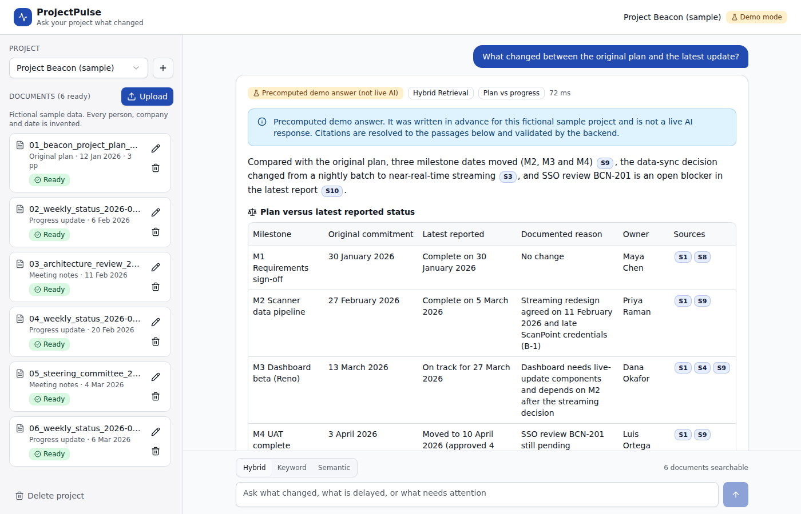
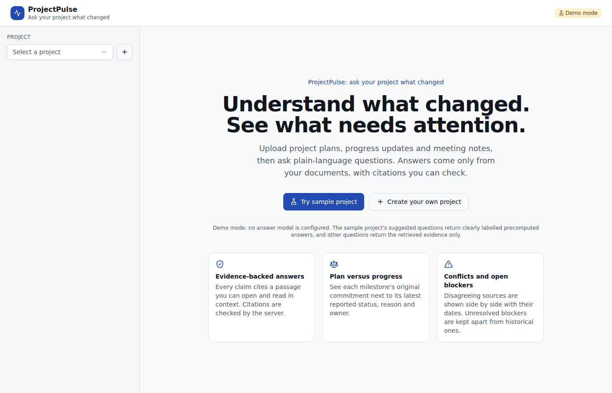
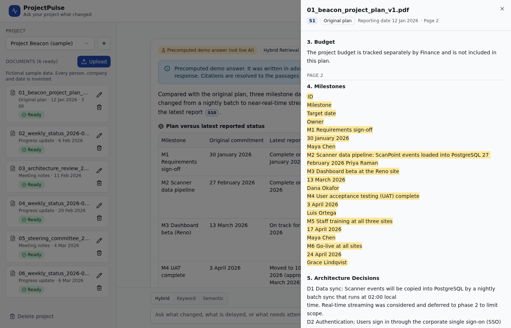
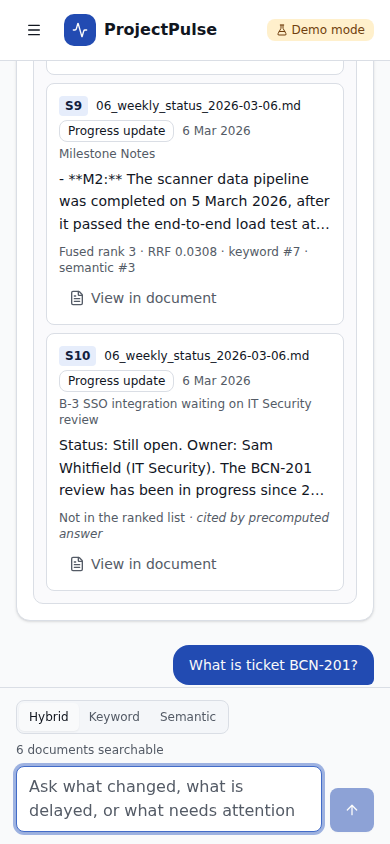
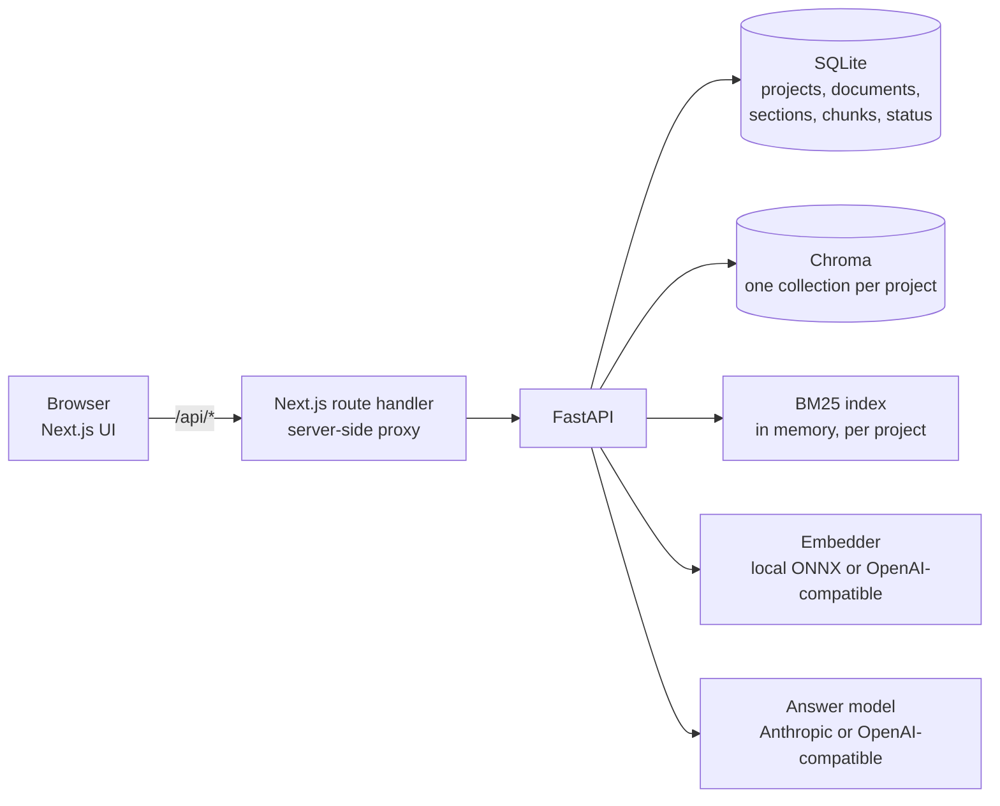

# ProjectPulse: Ask Your Project What Changed

[](https://github.com/vishnuvarthant1126-bit/projectpulse/actions/workflows/ci.yml)

**Understand what changed. See what needs attention.**

**Live demo: [projectpulse-iota.vercel.app](https://projectpulse-iota.vercel.app)** · read-only, fictional sample project, runs on free
hosting (the first visit after a quiet period can take up to a minute while the API wakes up).

ProjectPulse is a local web app for project plans, progress reports and meeting notes. You upload
the documents and ask plain-language questions such as *"Which milestones are delayed, and why?"*.
Every answer:

- uses only evidence retrieved from the selected project's documents,
- cites source IDs (S1, S2, …) that the server checks against the passages it actually retrieved,
- lets you open each citation to read the highlighted passage in context.



| Landing | Source viewer | Mobile |
|---|---|---|
|  |  |  |

---

## Features

- **Projects and documents.** Upload PDF, Markdown or TXT files, and assign each one a type
  (original plan, progress update, meeting notes, other).
- **Reporting-date confirmation.** The server suggests a date from the text (for example
  "Week ending: Friday 6 March 2026"). A document only becomes searchable after a date is
  confirmed. Upload time is never used as the reporting date.
- **Processing status and errors.** Documents move through queued → extracting → confirm date →
  indexing → ready, or failed. Failures come with a readable message: duplicate upload, wrong
  file type, over the size limit, or a scanned PDF (OCR is not supported in the MVP).
- **Hybrid search.** BM25 keyword, Chroma semantic, or both merged with reciprocal rank fusion.
  An expandable evidence panel shows each passage's fused, keyword and semantic ranks.
- **Plan-vs-progress answers.** A comparison table shows each milestone's original commitment,
  latest reported status, documented reason and owner. A missing reason or owner is shown as
  *Not stated*.
- **Conflicts and blockers.** Sources that disagree are shown side by side with their reporting
  dates. Blockers confirmed open in the latest update are kept separate from resolved ones and
  from ones whose status isn't confirmed.
- **Facts vs suggestions.** Documented facts and suggested actions appear in separate, labelled
  sections. There are no confidence percentages.
- **Demo mode.** A "Try sample project" button loads a fictional project. With no API key,
  its suggested questions return **clearly labelled precomputed answers**, and any other question
  returns the retrieved evidence only.

## Quick start (Docker Compose)

```bash
cp .env.example .env            # optional: add LLM_PROVIDER / LLM_API_KEY for live answers
docker compose up --build
# open http://localhost:3000 and click "Try sample project"
```

The backend image downloads the local embedding model (all-MiniLM-L6-v2 ONNX, about 90 MB) from
Hugging Face at build time. Only the web UI is published, and only on `127.0.0.1:3000`. The API
stays on the internal Docker network.

### Enabling live answers

```ini
# .env
LLM_PROVIDER=anthropic          # or: openai (also works with any OpenAI-compatible server)
LLM_MODEL=claude-sonnet-5       # any model your provider offers
LLM_API_KEY=...                 # read by the backend only; never sent to the browser
```

**Free option, Gemini:** Google AI Studio keys have a free tier (free-tier prompts may be used by Google to improve its
products). Use the OpenAI-compatible endpoint:

```ini
LLM_PROVIDER=openai
LLM_BASE_URL=https://generativelanguage.googleapis.com/v1beta/openai
LLM_MODEL=gemini-3.8-flash
LLM_API_KEY=...                 # from aistudio.google.com
```

Anthropic calls use the Messages API with JSON-schema structured output (`output_config.format`).
OpenAI-compatible calls use `response_format: json_schema`. Set `LLM_BASE_URL` for vLLM, Ollama
and similar servers.

## Public demo deployment

The live demo runs with `PUBLIC_DEMO=true`: only the fictional sample project is available,
uploads/edits/deletes return 403, the sample is loaded on startup, and questions are
rate-limited per visitor. The frontend is on Vercel and the API on Render (`render.yaml`).
Step-by-step instructions are in [`docs/DEPLOY.md`](docs/DEPLOY.md).

## Local development (without Docker)

```bash
# Backend (Python 3.11+)
python -m venv .venv && source .venv/bin/activate
pip install -r backend/requirements-dev.txt
python backend/scripts/download_model.py      # or set EMBEDDING_PROVIDER=openai
cd backend && uvicorn app.main:app --reload --port 8000

# Frontend (Node 22+), in another terminal
cd frontend && npm install
BACKEND_URL=http://localhost:8000 npm run dev  # http://localhost:3000
```

## Architecture



**Ingestion** (`backend/app/ingest.py`, `extraction.py`, `chunking.py`)

1. Validate the extension, size, magic bytes (a PDF must start with `%PDF-`) and binary content.
   Reject duplicates by SHA-256 within the project.
2. Extract text. PDFs use PyMuPDF with font-size heading detection and keep page numbers.
   Markdown uses `#` headings. TXT uses upper-case or underlined headings. The text is
   NFKC-normalised, which also expands PDF ligatures. A PDF averaging under 25 characters per
   page is rejected as scanned.
3. Split into sections (one heading on one page), then into overlapping chunks (default
   900 characters with 150 overlap) at paragraph, line or sentence boundaries. Each chunk keeps
   its project ID, document, type, reporting date, heading, PDF page and character offsets. The
   indexed text is prefixed with the document title and heading for context.
4. After the reporting date is confirmed, embed the chunks into the project's own Chroma
   collection and invalidate that project's BM25 cache.

**Retrieval** (`retrieval.py`, `keyword.py`)

- *Keyword:* Okapi BM25 (k1=1.5, b=0.75) with a Lucene-style IDF that stays positive in small
  projects. The tokeniser keeps identifiers such as `BCN-201` whole and also indexes their parts.
- *Semantic:* cosine similarity in Chroma, restricted to the project's collection.
- *Hybrid:* reciprocal rank fusion, `score(d) = Σ 1 / (RRF_K + rank_i(d))`, with RRF_K = 60.
  Ties are broken deterministically.
- Results are deduplicated by chunk ID and by identical text. Every hit is re-checked against
  SQLite (same project, status `ready`) before use.
- *Coverage rules:* questions about changes or delays get at least 2 original-plan and 3 update
  passages when they exist. Questions about blockers or status always include the latest
  progress report. At most 8 passages go to the answer model.

**Answering and validation** (`answering.py`, `qa.py`)

- Passages are wrapped in `<passage id="S3" document=… reporting_date=… page=…>` tags, with
  tag-like text inside escaped. The system prompt says passage content is untrusted data and
  lists the evidence rules.
- The model returns JSON: summary, findings, comparison rows, conflicts, blockers, suggested
  actions, missing information.
- The server then:
  - removes citations to IDs that weren't retrieved,
  - drops factual items left without a valid citation,
  - replaces empty reasons or owners with *Not stated*,
  - takes conflict dates from document metadata, not model output,
  - flags any date in the answer that doesn't appear in the passages it cites.
  If nothing supported survives, the answer becomes *insufficient evidence*.
- If no passages are retrieved, the model is not called and the answer says so.

## Configuration

All settings are environment variables (see [`.env.example`](.env.example)). The main ones:

| Variable | Default | Purpose |
|---|---|---|
| `LLM_PROVIDER` / `LLM_MODEL` / `LLM_API_KEY` / `LLM_BASE_URL` | `none` / `claude-sonnet-5` / – / – | Answer model |
| `EMBEDDING_PROVIDER` / `EMBEDDING_MODEL` / `EMBEDDING_MODEL_DIR` | `local` / all-MiniLM-L6-v2 / `models/…` | Embeddings |
| `CHUNK_SIZE` / `CHUNK_OVERLAP` | 900 / 150 | Characters |
| `RETRIEVAL_CANDIDATES` / `ANSWER_MAX_PASSAGES` / `RRF_K` | 20 / 8 / 60 | Retrieval limits |
| `PLAN_QUOTA` / `UPDATE_QUOTA` | 2 / 3 | Coverage rules for change questions |
| `MAX_UPLOAD_MB` | 10 | Upload limit |
| `LOG_DOCUMENT_CONTENT` | `false` | Questions and passages are not logged unless enabled |
| `PUBLIC_DEMO` | `false` | Read-only public demo: sample project only, writes blocked, questions rate-limited |

## Tests

```bash
cd backend && pytest            # 60 tests, about 3 s; uses a deterministic hash embedder, no network
ruff check app tests
cd ../frontend && npm run lint && npx tsc --noEmit && npm run build
```

| File | Covers |
|---|---|
| `test_isolation.py` | Search in all three modes and `/ask` only return the selected project's chunks; separate Chroma collections; an identifier from project A is not found in project B; duplicate detection is per project |
| `test_citations.py` | Invalid IDs removed and reported; uncited facts dropped; *Not stated* normalisation; invented dates flagged; conflict dates from metadata; prompt tag escaping; live path with a fake model; no-evidence abstention without a model call; every precomputed demo answer resolves and validates |
| `test_deletion.py` | Deleting a document removes SQLite rows, Chroma vectors, the BM25 hits and the stored file in every mode; project deletion; re-upload after delete |
| `test_retrieval.py` | RRF maths, identifier tokenisation, chunk offsets and overlap, exact-ID ranking, rank fields per mode, dedup, plan/update and latest-update coverage, documents awaiting review not searchable, doc-type changes |
| `test_upload.py` | Type, size, magic-byte and binary checks; scanned-PDF message; date detection and review flow; page and heading extraction; sample-project idempotency; config never exposes secrets |
| `test_public_demo.py` | Sample preloaded and the only listed project; every write returns 403; per-visitor and global rate limits |
| `test_llm_providers.py` | OpenAI-compatible provider (OpenAI, Gemini, vLLM): falls back from JSON-schema mode to JSON mode to plain output on HTTP 400; readable rate-limit and auth errors |
| `test_eval_dataset.py` | 30 questions, every supporting quote exists in its document, metric maths |

## Evaluation

See [`eval/README.md`](eval/README.md) for the dataset, relevance labels and method.

```bash
python eval/run_retrieval_eval.py   # Recall@k / MRR for keyword, semantic, hybrid
python eval/run_answer_eval.py      # needs LLM_* settings; add --judge for the labelled LLM judge
```

Measured retrieval results (26 scored questions, local all-MiniLM-L6-v2):

| Mode | Recall@1 | Recall@5 | Recall@8 | MRR | Evidence recall |
|---|---:|---:|---:|---:|---:|
| keyword | 0.340 | 0.647 | 0.801 | 0.631 | 0.821 |
| semantic | 0.218 | 0.676 | 0.894 | 0.569 | 0.904 |
| hybrid | 0.282 | 0.734 | 0.891 | 0.645 | 0.891 |

Hybrid had the best Recall@5 and MRR, but the paired bootstrap CIs include zero, so **this
dataset does not show hybrid to be significantly better**. Keyword is best at rank 1, and
semantic has slightly higher recall at 8. Answer-quality evaluation (correctness, citation
support, abstention) is implemented but **has not been run**, because no API key was available
while building this release.

The evaluation's embedding weights were obtained from an npm mirror of the model, because
Hugging Face was unreachable from the build sandbox (SHA-256: `onnx/model.onnx`
`6fd5d72f…46452`, `tokenizer.json` `be50c362…72037`). `download_model.py` prints the hashes of
the files it downloads so you can compare them.

## Security and privacy

- Local, single-user MVP with **no authentication**. Do not expose it to a network you don't
  control. Docker Compose publishes only the UI, and only on localhost.
- API keys are read from environment variables by the backend only. `/api/config` reports the
  provider and model name, never keys. The browser only talks to the Next.js proxy, which
  forwards an allow-list of API paths.
- Uploads are checked for extension, size, magic bytes and binary content, and file names are
  sanitised. Files are stored under `DATA_DIR/uploads/<project>/<id>.<ext>` and deleted with their
  document.
- Logs record IDs, sizes and counts, never document text or questions, unless you enable
  `LOG_DOCUMENT_CONTENT`.
- Document content is treated as untrusted in the prompt, and the server validates the output
  regardless of what the model returns.

## Limitations

- No OCR: scanned or image-only PDFs are rejected with an explanation.
- PDF tables are extracted as lines of text, so a table row can be split across lines.
  DOCX, spreadsheets and images are not supported.
- Heading detection is heuristic (font size for PDFs, `#` for Markdown).
- The BM25 index is rebuilt in memory per project, which is fine for hundreds of documents but
  not tens of thousands. Processing runs in-process (FastAPI background tasks), not in a job
  queue.
- Chat history is kept in the browser tab only.
- Answer quality depends on the configured model. It has not been measured here (see
  Evaluation).
- The date check catches dates that aren't in the cited passages. It does not verify every
  claim, and numbers and names are not checked the same way.
- Precomputed demo answers exist only for the sample project's suggested questions.

## Repository layout

```
backend/        FastAPI app (app/), tests/, scripts/download_model.py, Dockerfile
frontend/       Next.js 16 + Tailwind CSS 4 + shadcn/ui components, Dockerfile
sample_data/    Fictional "Project Beacon" documents, manifest, precomputed demo answers
eval/           questions.json, retrieval + answer evaluation scripts, results/
docs/           DEMO_SCRIPT.md, screenshots/
```

A note on shadcn/ui: the components in `frontend/src/components/ui` follow the shadcn/ui
(new-york) source and `components.json` is configured. They were written by hand because the
shadcn registry was unreachable from the build environment. `npx shadcn add …` works normally
on a regular network.

See [`docs/DEMO_SCRIPT.md`](docs/DEMO_SCRIPT.md) for a 3-minute portfolio walkthrough.
